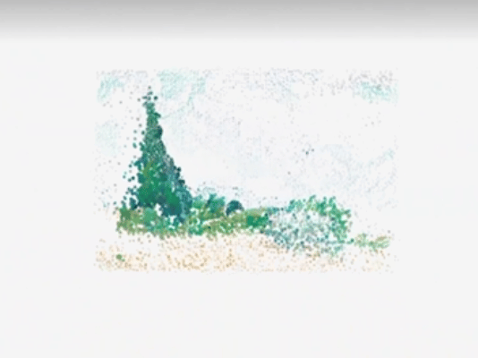

# Scene Traversal
_xzha0171-Tut1_GroupB_MajorProject_

## Animation Preview:  


## Users can interact with this work in the following ways:

- **Mouse interaction:**
Move the mouse across the screen to control the horizontal rotation of the scene.

- **Keyboard interaction:**
Press the UP_ARROW key to move the camera forward. 
Press the DOWN_ARROW key to move the camera backward.

- **Page loading:**
Click the mouse on the start screen to launch the animation.
This interaction allows users to explore the scene from different angles and depths, enhancing engagement and immersion.


## Individual Animation Approach:

1. **Animation Method:** 
I chose User Input as the driving method, using mouse and keyboard inputs to dynamically control the animation.

2. **Animation Properties:**
  - Rotation Angle: Users control the scene's horizontal rotation by moving the mouse.
  - Camera Depth: Users adjust the camera's depth dynamically using the up and down arrow keys.

3. **Difference from Other Members:**
One member's work uses Perlin noise to add dynamic effects to the sky and sea. Another created a time-based piece, where colors change over time to simulate real-world transitions. The sound-based work integrates background music, making the sky pulse in sync with the music's frequency. My work heavily relies on user input, featuring 3D particles to enhance depth perception, allowing users to navigate and adjust the camera view.


## Inspiration:


[The Sea at Les Saintes](https://www.youtube.com/watch?v=u0bwaIiTPIc)



[Wheat Field with Cypresses](https://www.xiaohongshu.com/explore/6574f998000000001502c53e?app_platform=ios&app_version=8.60&share_from_user_hidden=true&xsec_source=app_share&type=video&xsec_token=CBJ37PBF7_hw2ZxY7ev-UgGd1lYzoz3Iru5LPTLOB0nYA=&author_share=1&xhsshare=WeixinSession&shareRedId=NzxGQTdKO0w-O0pGTEwzN0tFT0g0OD1O&apptime=1731459812&share_id=ccfb1857ea8e4bfabc7c7c7c67266921&exSource=)


__Inspiration for my work:__

This idea comes from a digital artwork by Andrey Zakirzyanov. Van Gogh's Les Saintes-Maries-de-la-Mer inspired me to imagine traveling through a 3D scene based on an oil painting. 
This led me to explore the feasibility of turning our code into a 3D project where users could navigate within the scene. During my research, I came across a 3D particle-based oil painting shared by Nancy on Xiaohongshu. 
Since our base code is also built by stacking multiple rectangles, this discovery greatly enhanced the feasibility of my idea. These two sources of inspiration helped me better integrate visual effects with user interaction.


## Technical Explanation:
- **Technical Implementation:**

My code primarily uses p5.js and WebGL, leveraging their strengths to create an interactive and immersive 3D animation. Below are the core technical details:

1. WebGL Rendering: Utilizes WebGL's 3D rendering capabilities to create dynamic 3D scenes in p5.js using the WEBGL mode.
2. Mouse Interaction: Controls rotateY with mouseX to dynamically adjust the horizontal rotation of the scene, allowing users to change their viewpoint in real-time.
3. Keyboard Interaction: Detects keyboard input using keyIsPressed and smoothly controls the camera's Z-axis movement with the lerp function, enabling dynamic depth adjustments.
4. Dynamic Drawing of Rectangles and Boxes: Uses WebGL's box() function to add a 3D effect to each rectangle, making them appear more realistic in the 3D space.

- **Core Code Example:**

```
createCanvas(600, 500, WEBGL); // Use WebGL rendering mode
rotateY(mouseX * 0.05); // Control horizontal rotation of the scene with mouse X-axis

if (keyIsPressed) {
    if (keyCode === UP_ARROW) {
        camSpd = lerp(camSpd, 40, 0.09); // Move the camera forward with the UP arrow key
    } else if (keyCode === DOWN_ARROW) {
        camSpd = lerp(camSpd, -40, 0.09); // Move the camera backward with the DOWN arrow key
    }
}
camZ += camSpd; // Dynamically update the camera's Z-axis position

// Draw each box in 3D space
push();
translate(this.x, this.y, this.z + camZ);
rotate(45); // Add rotation to each box
box(size); // Use WebGL's box() function to draw a 3D cube
pop();
```

- **Modifications to the Team Code:**

Building on the original 2D design, I utilized WebGL's box() function and 3D rendering capabilities to extend the scene into a three-dimensional space.
This enhanced the real-time interactivity, allowing users to adjust the scene's perspective and depth through mouse and keyboard inputs.

- **External Tools and Technologies:**

_Why Use WebGL_

In this project, I chose WebGL to implement 3D animation effects. Compared to traditional 2D rendering, WebGL offers the following significant advantages:

1. Efficient 3D Rendering
WebGL is a browser-based 3D rendering technology that leverages GPU hardware acceleration. Unlike pure 2D rendering or CPU-based calculations, WebGL handles complex 3D scenes more efficiently, maintaining high frame rates even with dynamic animations or when rendering numerous objects.

2. Dynamic Perspective Control
WebGL allows free manipulation of the camera's position and angle in 3D space. With user inputs (mouse and keyboard), perspectives can be adjusted in real-time, enabling users to view 3D scenes from different angles. This dynamic perspective control is crucial for enhancing interactivity and immersion.


_How WebGL Works_

 WebGL is an API embedded directly in the HTML5 Canvas, enabling efficient graphics rendering through JavaScript and direct interaction with the GPU. Its core workflow includes:

1. Canvas and WebGL Context
Create a WebGL context supporting 3D rendering using createCanvas(width, height, WEBGL).

2. Drawing Shapes
WebGL provides functions like box() and sphere() to draw basic 3D shapes such as cubes and spheres.
In this project, I used box(size) to draw 3D cubes.

3. Dynamic Perspective Update
Users can adjust the scene’s perspective in real-time using mouse and keyboard inputs. For example:

    - Horizontal Rotation: Controlled by mouseX to dynamically adjust the horizontal view using rotateY.
    - Z-Axis Depth Adjustment: Controlled by keyIsPressed combined with arrow keys to move the camera forward or backward.


__WebGL plays a crucial role in this project, providing efficient 3D rendering capabilities for the animations. It enables smooth dynamic perspective switching in complex scenes, allowing users to explore the animation from multiple angles, greatly enhancing interactivity and immersion.__


## References： 
- [WebGL Basics Tutorial](https://developer.mozilla.org/en-US/docs/Web/API/WebGL_API/Tutorial)

- [YouTube Tutorial](https://www.youtube.com/watch?v=o5t7PxRJSXk)

Learned the basic principles of 3D drawing in p5.js through the tutorial.

- [CodePen Reference](https://codepen.io/Niekes/pen/mdOrXaw)
- [CodePen Reference](https://codepen.io/yoshihito_fujiwara_79/pen/XQxMyb)

The following links helped me understand the logic behind building 3D scenes and implementing user interaction:


- [p5.js examples](https://p5js.org/reference/p5/WEBGL/)
- [p5.js examples](https://p5js.org/reference/p5/box/)
- [p5.js examples](https://p5js.org/reference/p5/camera/)
- [p5.js examples](https://p5js.org/reference/p5/loadFont/)

Completed the entire project by learning from the features provided on the p5.js website.

